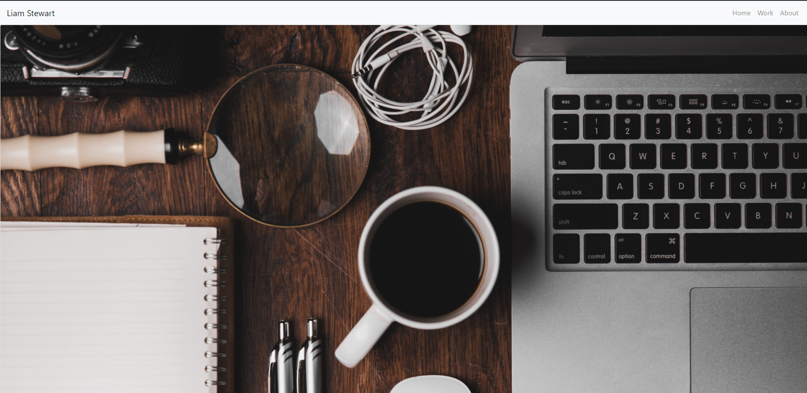

# React-Portfolio


## Application Photo



## Technologies Used
- React 
- React-Bootstrap - Styling components for the web page
- Git - Version control system to track changes to source code
- GitHub - Hosts repository that can be deployed to GitHub pages


## Code Snippet
    Here is a code snippet of the map method I used to create the different cards to display 6 of my projects on my "Work" page.

```
return (
        <div>
            {projects.map(app => (
                <ApplicationCard
                id={app.id}
                image={app.image}
                title={app.title}
                github={app.github}
                live={app.live} />
            ))}
        </div>
    )   
```
## Author Links
[LinkedIn](https://www.linkedin.com/in/liamsctewart/)<br>
[Github](https://github.com/LiamStewartDev)<br>
